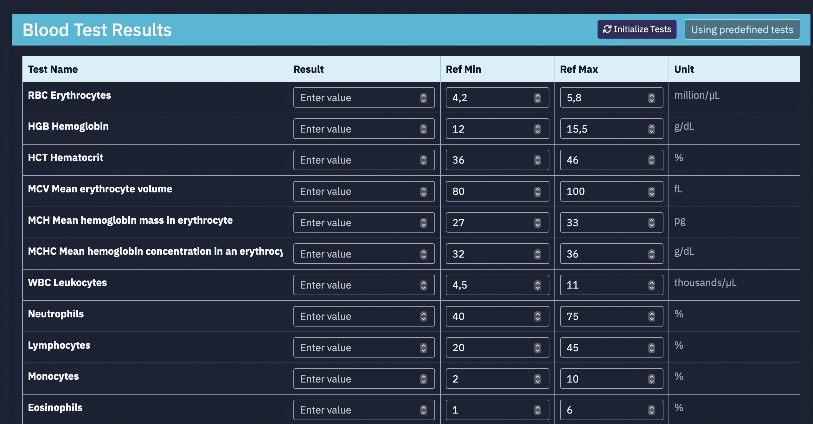
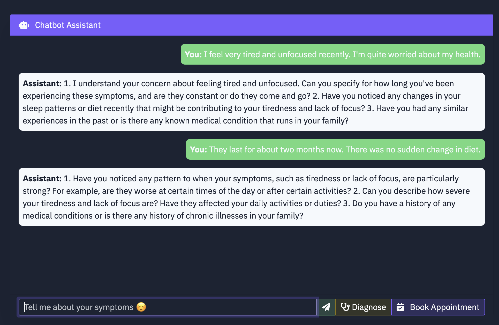
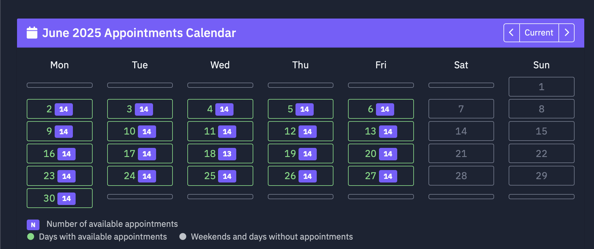

# Asystent analizy wyników badań i wywiadu medycznego

Inteligentna aplikacja webowa wspierająca wstępną analizę danych medycznych pacjenta, z wykorzystaniem sztucznej inteligencji.

## 
<div style="display: flex; gap: 20px; align-items: center;">
  
</div>

## 🎓 Informacje akademickie

Autorkami projektu są Natalia Askierko oraz Julia Młynarczyk.
Projekt jest realizowany w ramach zaliczenia przedmiotu:

**Rozwój aplikacji internetowych w medycynie**  
Inżynieria biomedyczna, semestr 6, specjalność: Informatyka w medycynie  
Politechnika Gdańska, Wydział ETI (Elektroniki, Telekomunikacji i Informatyki)  
**Typ zajęć:** wykład + projekt  
**Prowadzący:**  
- dr inż. Anna Węsierska  
- mgr inż. Natalia Kowalczyk  

Szczegóły znajdują się w konspekcie przedmiotu oraz w informatorze ECTS PG.

## 📌 Opis projektu

Celem projektu jest stworzenie systemu, który:
- na początku wyświetla formularz do uzupełnienia wyników badań oraz powszechnych objawów,
- automatycznie analizuje dane laboratoryjne,
- przeprowadza interaktywny wywiad medyczny na podstawie odpowiedzi pacjenta,
- identyfikuje potencjalne nieprawidłowości i na tej podstawie zadaje dalsze pytania pogłębiając wywiad,
- rekomenduje odpowiedniego lekarza specjalistę z dostępnych w danej placówce medycznej oraz wskazuje dostępne terminy wizyt,
- umożliwia zapisanie się na wizytę bezpośrednio przez system.

Całość oparta jest na technologiach webowych oraz modelach AI przetwarzających dane w czasie rzeczywistym.

## 🎯 Cele techniczne projektu

- Stworzenie aplikacji internetowej z wykorzystaniem wybranych technologii frontendowych i backendowych.
- Pozyskiwanie oraz analiza danych medycznych za pomocą formularza internetowego.
- Integracja komponentów sztucznej inteligencji w celu wspomagania wstępnej diagnostyki.
- Umożliwienie użytkownikowi uzyskania wstępnych sugestii dot. specjalizacji lekarskiej.

## 🩺 Cele i założenia projektu

- [✓] Zautomatyzowanie analizy podstawowych wyników badań
- [✓] Ułatwienie wstępnej diagnostyki bez kontaktu z lekarzem
- [✓] Wsparcie pacjenta w podjęciu decyzji o konsultacji specjalistycznej
- [✓] Weryfikacja przydatności AI w praktyce medycznej

## ⚙️ Funkcjonalności
- Formularz do wprowadzania wyników badań (morfologia, OB, CRP itp.)
- Interaktywny chatbot prowadzący wywiad medyczny
- Analiza w czasie rzeczywistym na podstawie danych wejściowych
- Rekomendacja lekarza i terminów
- Możliwość zapisu na wizytę
- Obsługa wielu użytkowników

## 🛠️ Technologie

Wykorzystywane technologie to:
- Python 3.x
- Flask
- Flask SocketIO
- Flask WTF
- Request
- Langchain + OpenAI API
- JSON, jonsify
- HTML/CSS/JavaScript
- Bootstrap
- SQLAlchemy

## 🚀 Uruchomienie aplikacji

1. Sklonuj repozytorium:
    ```bash
    git clone https://github.com/natka-wariatka/RAIM-project.git
    ```
2. Przejdź do katalogu projektu:
    ```bash
    cd RAIM-project
    ```
3. Zainstaluj zależności:
    ```bash
    pip install -r requirements.txt
    ```
4. Uruchom aplikację:
    ```bash
    python app.py
    ```
5. Wejdź w przeglądarkę na adres: [http://localhost:5000](http://localhost:5000)

## 📸 Screenshoty

| Formularz danych | Wywiad AI | Rekomendacja wizyty |
|------------------|-----------|----------------------|
|  |  |  |


